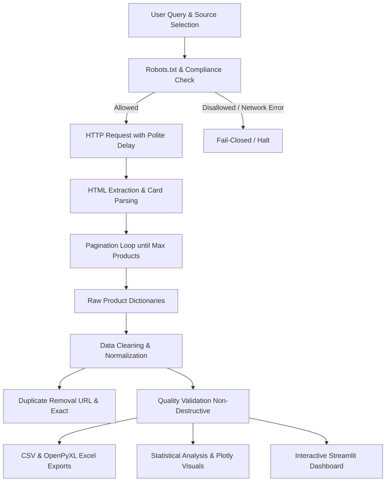

# E-Commerce Product Data Web Scraper

A robust, modular, and compliance-first Python web scraping, data processing, and visualization system. This project collects structured product records, sanitizes and standardizes messy text, normalizes pricing and ratings, eliminates duplicate entries, performs automated quality validation, and exports clean datasets to both CSV and Excel formats. It features both an interactive command-line interface (CLI) and a rich Streamlit web dashboard.

---

## Table of Contents

- [Project Overview](#project-overview)
- [Key Features](#key-features)
- [Architecture & Design](#architecture--design)
- [Technologies Used](#technologies-used)
- [Project Directory Structure](#project-directory-structure)
- [Installation & Setup](#installation--setup)
- [How to Run](#how-to-run)
  - [Streamlit Web Application](#streamlit-web-application)
  - [Command-Line Interface (CLI)](#command-line-interface-cli)
- [Testing Source vs. Production APIs](#testing-source-vs-production-apis)
- [API Configuration](#api-configuration)
- [Running Automated Tests](#running-automated-tests)
- [Data Pipeline Details](#data-pipeline-details)
- [License & Academic Integrity](#license--academic-integrity)

---

## Project Overview

The **E-Commerce Product Data Web Scraper** is designed to bridge the gap between raw, unstructured web data and production-ready business intelligence. In accordance with legal, ethical, and academic standards:

1. **Test Demonstration Source**: Uses [Books to Scrape](https://books.toscrape.com/) as a designated safe sandbox, labeled strictly as **Test Site**, to prove the live, multi-page HTML extraction pipeline without breaking site terms or anti-scraping protections.
2. **Authorized Enterprise E-Commerce (Amazon, Flipkart, Alibaba)**: Built on an API-first interface (`BaseScraper`). Direct scraping, CAPTCHA bypass, and stealth evasion are explicitly prohibited. Instead, clean adapter stubs connect directly to official/partner APIs when credentials (`.env`) are supplied.

---

## Key Features

- **Object-Oriented Scraper Architecture**: Standardized `BaseScraper` contract ensuring all sources produce uniform dictionaries (`name`, `price`, `rating`, `availability`, `url`, `category`, `description`, `source`).
- **Robots.txt Compliance & Domain Caching**: Synchronously validates crawling permissions against `robots.txt` per RFC 9309 rules, caching parsed policies by hostname to avoid duplicate network roundtrips.
- **Polite Rate Limiting & Session Pooling**: Reuses persistent `requests.Session` connections with realistic user-agent headers, configurable timeouts, and polite inter-request delays.
- **Controlled Pagination**: Traverses multi-page catalogs up to user limits with safety bounds to prevent infinite loops.
- **Search & Filtering**: Real-time keyword filtering across catalog pod titles.
- **Data Cleaning & Text Normalization**:
  - Cleans encoding artifacts (e.g., latin1/mojibake errors like `Â`).
  - Strips arbitrary currency symbols (`£`, `$`, `€`, `₹`) and thousand separators, parsing prices to standard floats.
  - Converts text ratings (`One` → 1.0, `Five` → 5.0) and fractional ratings (`4.5 out of 5`) into a 1.0–5.0 numeric scale.
  - Normalizes inventory statuses (e.g., `in stock (19 available)` → `In Stock`).
- **Deduplication & Non-Destructive Validation**:
  - Removes duplicate records using URL-based hashing and exact row matching.
  - Preserves records with missing optional fields (e.g., missing descriptions or ratings) while filtering invalid records missing mandatory keys (name or URL).
- **Multi-Format Styled Exports**:
  - **CSV**: UTF-8 with BOM (`utf-8-sig`) for compatibility with Microsoft Excel on Windows.
  - **Excel**: Formatted `.xlsx` workbooks generated using `openpyxl`, featuring bold styled headers, background fills, and auto-adjusted column widths.
- **Visual Analytics**: Interactive Plotly visualizations (price distribution histograms, rating breakdown bar charts, availability pie charts, and category distribution charts).
- **Streamlit Web UI**: Full-featured user interface with metric summary cards, clickable catalog links, dynamic Plotly charts, insights cards, and direct CSV/Excel download buttons.
- **Robust Centralized Logging**: Logs operations, network requests, HTTP status codes, cleaning actions, and errors to `logs/scraper.log`.

---

## Technologies Used

- **Python 3.12**
- **Requests**: HTTP networking and session pooling.
- **BeautifulSoup4**: HTML document parsing and CSS selector extraction.
- **Pandas**: Structured data cleaning, transformation, and deduplication.
- **OpenPyXL**: Styled Microsoft Excel spreadsheet generation.
- **Plotly**: Interactive charts and data visualizations.
- **Streamlit**: Modern interactive web interface.
- **Matplotlib**: Headless and static visualization engine.
- **Python-dotenv**: Environment variable management.
- **Unittest**: Automated test suite.

---

## Project Directory Structure

```text
Web Scraping Project/
│
├── app.py                     # Streamlit web dashboard application
├── main.py                    # Command-line interface entry point
├── requirements.txt           # Clean runtime dependencies
├── README.md                  # Comprehensive documentation
├── .gitignore                 # Git ignore rules (logs, venv, cache, secrets)
├── .env.example               # Template for API credentials
│
├── scraper/                   # Core scraping & data processing package
│   ├── __init__.py            # Package initialization & exports
│   ├── base_scraper.py        # BaseScraper interface & ApiNotConfiguredError
│   ├── scraper_manager.py     # Multi-scraper registry & coordinator
│   ├── test_scraper.py        # Fully working scraper for Test Site
│   ├── amazon_scraper.py      # Authorized API integration stub for Amazon
│   ├── flipkart_scraper.py    # Authorized API integration stub for Flipkart
│   ├── alibaba_scraper.py     # Authorized API integration stub for Alibaba
│   ├── http_client.py         # Resilient HTTP client with rate-limiting
│   ├── robots_checker.py      # Robots.txt compliance engine with domain cache
│   ├── data_processor.py      # Data cleaning, normalization, and validation
│   ├── exporter.py            # CSV & OpenPyXL Excel export utilities
│   ├── analyzer.py            # Summary statistics and metric calculation
│   ├── visualizer.py          # Matplotlib-based chart generation
│   ├── config.py              # Centralized application configuration
│   └── logger.py              # Log configuration & handlers
│
├── tests/                     # Automated test suite (34 unit tests)
│   ├── __init__.py
│   ├── test_http_client.py    # Tests for HTTP requests, errors, and timeouts
│   ├── test_robots_checker.py # Tests for robots.txt rules and caching
│   ├── test_test_scraper.py   # Tests for extraction, pagination, and details
│   ├── test_scraper_manager.py# Tests for scraper routing and API errors
│   ├── test_data_processor.py # Tests for price/rating cleaning & validation
│   ├── test_exporter.py       # Tests for CSV/Excel file creation & styling
│   └── test_analyzer.py       # Tests for statistical metrics & edge cases
│
├── output/                    # Generated datasets and exports
│   ├── products.csv           # Cleaned product CSV dataset
│   └── products.xlsx          # Cleaned product Excel workbook
│
├── logs/                      # Application activity logs
│   └── scraper.log            # Detailed execution & audit log
│
└── notebooks/                 # Exploratory research notebooks
    └── 01_requests_basics.ipynb
```

---

## Installation & Setup

### 1. Prerequisites
- **Python 3.12** installed on your system.
- PowerShell or Terminal with administrative access if required.

### 2. Create Virtual Environment
Open PowerShell inside the project folder:
```powershell
python -m venv .venv
```

### 3. Activate the Virtual Environment
On Windows PowerShell:
```powershell
.venv\Scripts\Activate.ps1
```
*(If you encounter execution policy restrictions in PowerShell, run `Set-ExecutionPolicy -Scope Process -ExecutionPolicy Bypass` first).*

### 4. Install Dependencies
Install all required packages from `requirements.txt`:
```powershell
pip install -r requirements.txt
```

---

## How to Run

### Streamlit Web Application

Launch the web dashboard:
```powershell
streamlit run app.py
```
Or when running from the virtual environment directly:
```powershell
.\.venv\Scripts\streamlit.exe run app.py
```

The application will open in your default browser at `http://localhost:8501`.

#### Using the UI:
1. **Target Source**: Choose **Test Site** from the sidebar dropdown (or select Amazon/Flipkart/Alibaba if credentials are configured).
2. **Search Query**: Type a keyword (e.g. `light`, `poetry`, `art`).
3. **Maximum Products**: Select the target item count (1–100).
4. **Click `🔎 Search Products`**:
   - Live scraping runs in the background.
   - Summary metric cards update (`Products Found`, `Average Price`, `Average Rating`, `In Stock`).
   - Cleaned catalog table renders with clickable product URLs.
   - Interactive Plotly charts visualize price, rating, availability, and category distributions.
   - Key insights highlight most expensive, cheapest, and highest-rated products.
   - Direct download buttons provide instant access to the cleaned `CSV` and `Excel` files.

---

### Command-Line Interface (CLI)

Run `main.py` directly from the command line:

#### Basic Test Scrape:
```powershell
python main.py --query "light" --websites test --max-products 5
```

#### Save Visualizations to Disk:
```powershell
python main.py --query "art" --websites test --max-products 10 --save-plots
```
*(Saved plots will be created in `output/plots/`).*

#### View CLI Options:
```powershell
python main.py --help
```

---

## Testing Source vs. Production APIs

| Feature / Website | **Test Site** (Books to Scrape) | **Amazon / Flipkart / Alibaba** |
| :--- | :--- | :--- |
| **Purpose** | Pipeline demonstration & evaluation | Production authorized integration |
| **Authentication** | None required | Requires authorized API credentials |
| **Access Method** | Live HTML parsing & HTTP requests | Official partner / developer REST API |
| **robots.txt Checked** | Yes (`/robots.txt` evaluated) | Handled by API protocols |
| **Default Status** | **Ready to run out-of-the-box** | Configured via `.env` credentials |

---

## API Configuration

To enable Amazon, Flipkart, or Alibaba integration:

1. Copy the template `.env.example` to `.env`:
   ```powershell
   Copy-Item .env.example .env
   ```
2. Open `.env` and provide your authorized API keys:
   ```env
   AMAZON_API_KEY=your_authorized_amazon_key_here
   FLIPKART_API_KEY=your_authorized_flipkart_key_here
   ALIBABA_API_KEY=your_authorized_alibaba_key_here
   ```
3. If credentials are missing, the system will gracefully alert you in both the UI and CLI rather than attempting prohibited web scraping or returning simulated fake records.

---

## Running Automated Tests

A comprehensive unit test suite covering all modules is located in `tests/`.

Run all 34 automated unit tests:
```powershell
python -m unittest discover tests -v
```
Or via `.venv`:
```powershell
.\.venv\Scripts\python.exe -m unittest discover tests -v
```

### Test Coverage Highlights:
- **`test_http_client.py`**: Validates request dispatch, connection failures, timeout recovery, and robots.txt blocking.
- **`test_robots_checker.py`**: Tests RFC 9309 rules, 404 allowances, fail-closed handling on unreachable hosts, and domain caching.
- **`test_test_scraper.py`**: Verifies HTML card extraction, detail page parsing, pagination, and missing-field tolerance.
- **`test_scraper_manager.py`**: Tests scraper registry, multi-search coordination, and `ApiNotConfiguredError` detection.
- **`test_data_processor.py`**: Tests multi-currency conversion, word-to-numeric ratings, duplicate removal, and non-destructive validation.
- **`test_exporter.py`**: Validates CSV and OpenPyXL Excel generation, directory auto-creation, and header styling.
- **`test_analyzer.py`**: Validates summary statistics, top/lowest calculations, and empty DataFrame edge cases.

---

## Data Pipeline Details



---

## License & Academic Integrity

This project is developed as part of **Internship Task 11**. It strictly respects web crawling ethics, website Terms of Service, and robots.txt directives. Real-world protected e-commerce portals are accessed strictly through authorized programmatic interfaces.